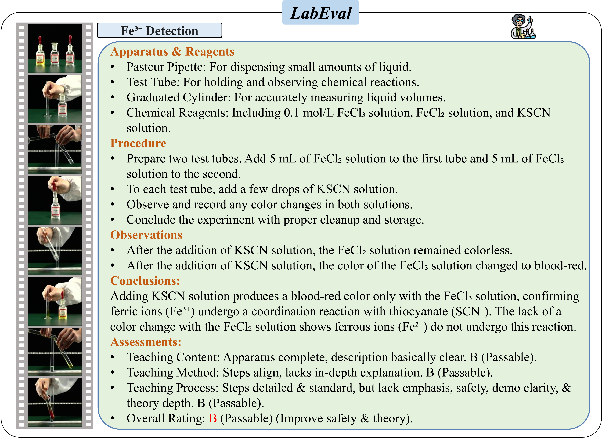
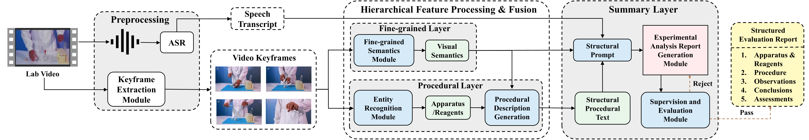
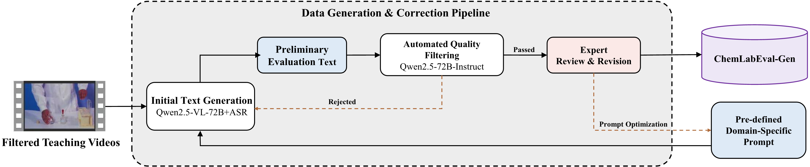

# VASE: Video Analysis of Structured Experiments for Chemistry Class

---

## 🔗 Project Resources

* 📄 **Paper**: *under review*
* 💻 **Code**: *will be released upon acceptance*
* 📊 **Dataset**: [ChemLabEval](https://huggingface.co/datasets/VASE-Project/ChemLabEval)  Only a small subset of samples is publicly available at this stage. The full dataset will be released upon paper acceptance.

## Abstract
Classroom teaching evaluation (CTE) is the core mechanism of education quality assurance. With the roaring success of Multimodal Large Models (MLMs), they are becoming prevalent in the education field. However, applying MLMs to CTE requires high computing costs and domain-specific datasets for fine-tuning. This paper introduces VASE (Video Analysis of Structured Experiments), a highly efficient and explicitly structured framework that only requires entity detector fine-tuning, designing structural prompts to extract and organize multimodal information from teaching videos for generating structured reports that cover teaching details and qualitative and quantitative teaching evaluations. 

Meanwhile, we develop ChemLabEval, the first chemical experiment benchmark for CTE. It consists of two subsets: ChemLabEval-Det, which contains over 75,000 bounding boxes for apparatus detection, and ChemLabEval-Gen, which comprises 708 videos with detailed, expert-annotated evaluation texts. Experiments show that VASE dramatically outperforms all end-to-end baselines, and key semantic metrics are significantly improved compared to its core large model. Our work presents a hierarchical framework for evaluating chemistry laboratory classroom teaching through reliable video analysis and contributes a valuable new resource to the community.

### Main Contributions
- We construct the first structured benchmark for chemical experiments, **ChemLabEval**, comprising apparatus and reagent container annotations, 708 instructional videos, and corresponding evaluation reports.
- We propose **VASE**, a resource-light teaching analysis framework, which satisfies our proposed LabEval task without fine-tuning large models.
- Extensive experiments show that VASE outperforms all baselines across various metrics and enables seamless adaptation to educational settings cost-effectively.

## Framework Overview

**VASE Framework:**

**Generation Pipeline:**

